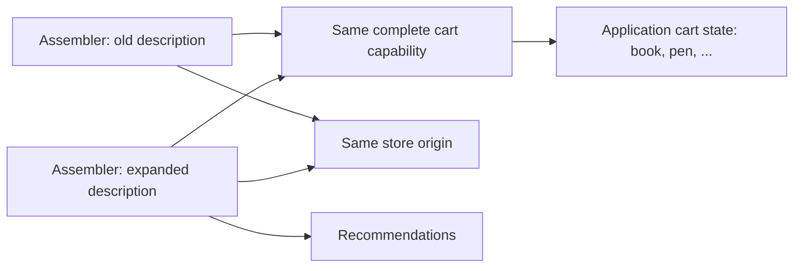

# Runnable examples: model and approach

The [example catalogue](../../examples/README.md) is a path from a consumer's
use case to a program they can run. Each example states its input, expected
observation, ownership and limits. Go and TypeScript implement the same story
using the public packages.

## The bookshop model

The first four examples use one domain model:

| Access relative to the shop | Meaning | State owner |
| --- | --- | --- |
| `[]` | Return `Bookshop` | The application's store handler |
| `['cart', 'list']` | Return a copy of the current item list | The application's cart |
| `['cart', 'add']` | Append the supplied item string | The same cart |
| `['recommendations']` after expansion | Return `['pencil']` | The application's recommendation handler |

The cart starts with `book` and `pen`. The runtime delivers requests
asynchronously and supplies responses and invocation cancellation. The Go model
locks its item list because handlers can run concurrently. The TypeScript model
updates the list in a synchronous handler body. Both await RPC completion before
checking an effect: a successful Wire send alone means admission.

The application creates one local Wire pair, attaches one dispatcher to the
receiving endpoint, and registers the handlers. Selected send access presents
store information, the cart and recommendations. This keeps the example about
composition while still exercising the production runtime. The
[probe example](../../examples/probe/README.md) adds the generated model boundary
and a real WebSocket connection between languages.

## Construction and use are separate surfaces

An assembler creates `Declared(origin, children)`, with different native
spellings in Go and TypeScript. The origin supplies behavior at the empty path.
Each child is **complete Wire access**, which may itself be a selected view,
a composite or an opaque guard. The assembler can keep the description and
decompose it into copied construction containers.

Callers receive `Bind()` / `bind()`: send access with no structural
enumeration, receiver attachment or close authority. Selecting a path gives
relative send access. It neither discovers a tree nor copies its domain state.

The [rebuild example](../../examples/rebuild-with-state/README.md) keeps the old
origin and cart capability, adds recommendations and binds the new description.
The old access remains usable. An add through the new access is visible through
the old access because both reach the same cart. Reconstruction does not clone,
freeze, serialize or replay the cart.

A retained subtree means keeping access to that whole child, including whatever
behavior and state it carries. Its internals may be unknown to the assembler.
There is no promise that every Wire can be enumerated or converted into a
recursive data tree. These examples use the declared composition API directly;
they do not implement a Deixis adapter or a BitTree provider.

## Guards, cancellation and ownership

The [guard example](../../examples/guarded-child/README.md) wraps the cart with a
two-add admission budget. Reusing that complete child retains both the cart
and the wrapper's remaining budget. The third add is refused before dispatch.
The wrapper counts admitted requests, not committed effects, and forwards
control frames without charging them. This application policy is independent
of composition and is not a demonstration of the optional authority profile.

The [cancellation example](../../examples/cancel-pending-request/README.md) uses
a related jobs model: one operation waits until cancelled and another returns
`replacement`. After the first handler starts, the assembler replaces its
description. The caller cancels using its captured access; the runtime still
cancels the original invocation. A subsequent call through newly bound access
uses the replacement. The program checks both the caller's result and the
original handler's cancellation signal, with bounded waits rather than sleeps.

In every example the application owns the endpoints and dispatcher and closes
them explicitly. Descriptions, bound access and selected views borrow the
capabilities they contain. Retaining a child does not transfer lifecycle
authority. See the [Wire reference](wire.md) for the actual API and routing,
admission and ownership rules.

## Where examples live

Bitwire owns the shared contract, language presentations, conformance cases and
a [use-case catalogue](https://github.com/Bitspark/bitwire/blob/main/examples/README.md).
Nightseam owns these executable runtime consumers. A domain repository owns
examples of its own domain interface; a catalogue links them instead of
copying their implementation or adding a private checkout dependency.

Use-case directories live directly under `examples/`. Each has:

- `README.md`: purpose, model, prerequisites, exact command, expected result,
  current availability and limits.
- `example.json`: title, ordering, languages, runner and availability.
- `go.mod` and `package.json`: ordinary consumer dependencies aligned with the
  coordinated Nightseam version.
- `go/main.go`, `ts/main.ts`, `tsconfig.json` and `expected.txt` for a standalone
  Wire recipe.

Probe keeps its existing generated family, server and client layout and selects
the `probe` runner. Its smoke owns server startup, an ephemeral port, bounded
readiness, process cleanup and the expected exchange. Shared helpers handle
packaging and execution; domain behavior stays visible in each example.
Some short setup is repeated so each directory can be read and copied alone.

## Source, packaging and the CI promise

`node scripts/examples.mjs list` reads the inventory without building anything.
`run <name>` selects a recipe, and `check --all` runs the whole catalogue.
Wire recipes support `--language=go|ts`; probe always runs both ends.
Unknown examples, unsupported options and incomplete recipes fail.

The runner installs the frozen root lockfile, builds packages and copies release
notices. It copies each consumer outside the workspace. TypeScript resolves
packed packages through temporary overrides; Go uses a local module proxy under
a distinct rehearsal version with a private module cache and `GOWORK=off`.
No committed consumer uses a private path or workspace replacement.
It type-checks TypeScript, executes both programs and compares exact output,
normalizing only platform newlines. Programs also assert the behavior before
printing; matching a transcript alone cannot conceal reset state or a wrong
cancellation destination. Probe keeps the broader package/import smoke.

The `examples` CI matrix runs the same `check --all` command on Linux and
Windows. The required `full` job depends on its success. Fast script checks hold
the inventory and output comparator. Adding a use case therefore requires its
runnable implementations and documented result together. Keep README output and
`expected.txt` aligned; changing an advertised result is a change to the example.

The five composition examples are available from source and require the
unreleased declared API. The checked-in dependency version is still 0.6.0
because this repository moves versions in lockstep. A passing packaged-source
run is evidence about the checkout, not registry publication or downstream
adoption. The probe also exists in released tags; registry smokes remain part
of the release process. Other runtime ports, full domain adapters, persistence,
remote reconstruction and broader use cases are separate work.
