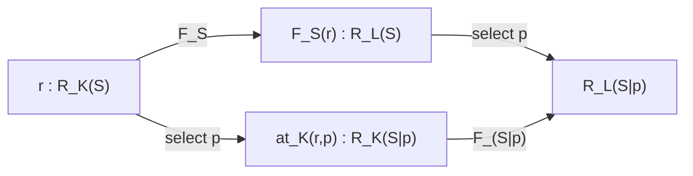
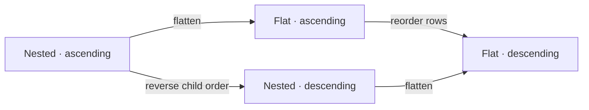
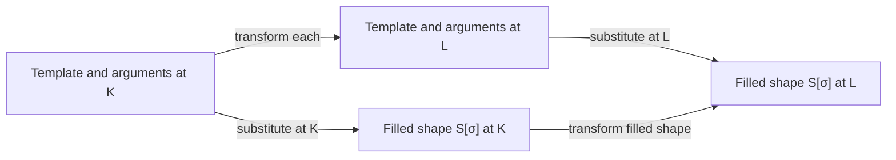

# Contracts, implementations, and representations

The [theory index](README.md) gives the reading order. The
[concept/law reference](reference.md) maps definitions to model types and checked
examples; the [Nightseam interpretation](nightseam.md) relates them to the current
implementation and its separate design questions.

## 1. What the model describes

The model distinguishes a contract's shape `S`, its behavioral specification
`B`, and an implementation's actual behavior `b`. A contract is `C = (S, B)`.
An artifact can represent `C`; an instance can satisfy `C`. These are different
relations. Two instances may satisfy the same contract while behaving differently.

`Representation<X, K>` represents a chosen semantic subject `X` at coordinates
`K`. A coordinate path changes representations of that same subject. The subject
can be a shape, a contract, a native type, or a particular implementation.
Structural navigation selects a part of `S`; structural substitution fills holes
and produces `S[σ]`. Their commuting laws remain useful, but preserving structure
alone does not establish satisfaction or preserve a particular instance's behavior.

TypeScript is the **metalanguage** of this model. Its interfaces describe the
model; the Go and TypeScript artifacts in the examples are objects within that
model. These definitions state a developing theory; the examples supply finite
evidence for its laws. They do not change Nightseam's runtime or generator API.

The core is in [model.ts](model.ts), which contains only
types and interfaces. [examples/coordinates.ts](examples/coordinates.ts) shows
language and role coordinates. [examples/hierarchy.ts](examples/hierarchy.ts)
adds shape trees and executable checks of the transparency laws.
[examples/composition.ts](examples/composition.ts) adds whole-shape holes and
substitution. [examples/behavior.ts](examples/behavior.ts) adds realizations,
satisfaction, adapters, generators, and an exhaustive finite behavior example.
The [self-contained HTML edition](index.html) includes all four theory pages,
interactive examples, the complete model, compile-only assertions, and all four examples.

| Notation      | Meaning                                                                |
| ------------- | ---------------------------------------------------------------------- |
| `X`           | An arbitrary semantic subject in the general model                     |
| `S`           | Shape or structural signature; finite trees are one encoding           |
| `Behavior[S]` | Actual behaviors admitted by a chosen observation model for `S`        |
| `B`           | A predicate on `Behavior[S]`, specifying acceptable behavior           |
| `C = (S, B)`  | A contract                                                             |
| `T`, `i`, `b` | A selected native realization, one of its instances, and its behavior  |
| `O`           | The type of opaque local values                                        |
| `K`, `M`, `N` | Coordinate assignments; structural sections also use `L` as a coordinate |
| `D`, `L`, `H` | Declaration, target, and generator-host languages in the semantic sections |
| `r : R_K(S)`  | Shorthand for `Representation<S, K>`                                   |
| `p`, `q`      | Shape paths: lists of child keys                                       |
| `P`, `Q`      | Coordinate paths: sequences of transformation instances                |
| `S\|p`        | The sub-shape selected by a valid path `p`                             |
| `≈_K`         | The chosen equivalence of representations at `K`, for the same subject |

`X` replaces the earlier use of `S` for an arbitrary subject. `Shape<O, G>`
names the tree previously called `Contract<O, G>`; `Contract<S, Beh>` now names
the semantic pair. `Beh` is the TypeScript carrier for `Behavior[S]`, whereas
`B` is a predicate on that carrier. Neither `B` nor `b` is a syntax coordinate.

## 2. Shape, specification, and actual behavior

A shape specifies available sorts, fields, constructors, operations, arguments,
results, and roles. A behavior domain fixes what their execution can mean and
what can be observed: state changes, return values, errors, effects, interaction
traces, or other relevant observations. Choosing that domain is part of the
interpretation, not something a method signature determines.

```text
S : Shape
Behavior[S] : Type
≈_S : an observational equivalence on Behavior[S]
B : Behavior[S] -> Prop
C = (S, B)

Contracts = Σ S : Shape. { B : Behavior[S] -> Prop | B respects ≈_S }
```

Here `Σ` forms a dependent pair. The specification depends on the shape through
its behavior domain. This family is relative to a chosen domain and equivalence
for each shape; changing the observations changes that interpretation. In
[model.ts](model.ts), `Contract.domain` retains this choice explicitly.
`Prop` means a mathematical proposition; arbitrary behavior
satisfaction need not be decidable. A specification may be presented by laws,
a reference model, a protocol, or a set of admitted behaviors.

**B1 — Observational invariance.** If `b ≈_S b'`, then `B(b) ↔ B(b')`.
The observation model must distinguish everything the specification constrains.
If a law cares about an effect, that effect cannot be hidden by the equivalence.
A contract imposing no behavioral restriction uses the predicate `true`.

For BooleanCell, `S` contains `read : Unit -> Bool` and `write : Bool -> Unit`.
One possible `B` requires reads to leave behavior unchanged and a completed
write to determine later reads until the next write. This example fixes
sequential, total operations with no external mutation, failure, or concurrency.
It leaves the initial Boolean value unspecified. A storing cell initially true
and one initially false both satisfy `B`; a read distinguishes them. A cell
ignoring writes has the right shape and violates `B`.

Thus `B` is the **specification of acceptable behavior**, not the implementation's
actual behavior `b`. Both belong to the semantic layer and may have syntax.

## 3. Native realizations, instances, and satisfaction

A native realization includes a carrier of native values and an interpretation
of those values as behavior at `S`:

```text
T : NativeRealization[L, S]
Instance[T] : Type
BehaviorOf_T : Instance[T] -> Behavior[S]
i : Instance[T]
b = BehaviorOf_T(i)

i ⊨_T C  iff  B(BehaviorOf_T(i))
Implementation[L, C] = Σ T : NativeRealization[L, S].
                        Σ i : Instance[T]. B(BehaviorOf_T(i))
```

The last `Σ` packages an instance with evidence of satisfaction; equivalently it
is the refinement `{ i : Instance[T] | i ⊨_T C }`. A native instance is a candidate
implementation before satisfaction is established. `ModelType` names `T`,
`ModelInstance<T>` names a native value with its selected realization, and
`ContractImplementation<T, C>` reifies the instance and its satisfaction witness
for the selected contract.

For stateful systems, `i` includes the relevant current or initial state and
environment, or denotes a configuration including them. Behavior describes
possible interactions from that configuration. Source code may instead denote
a factory; initialization must then be included before claiming it denotes `i`.
`BehaviorOf` is a semantic interpretation supplied by the model, not a general
program-analysis algorithm or a concrete run sampling all possibilities.

Neither `C` nor `(C, L)` selects a unique `T`. A Go method interface and a Go
record of function values can realize the same shape. They require different
bindings. Within either realization, different values can have different
behaviors, including behaviors violating `B`. A native method signature alone
does not refine its inhabitants to lawful implementations.

**I1 — Satisfaction concerns this instance.** An implementation witness must
concern `BehaviorOf_T(i)` in the contract's domain, or an observationally
equivalent behavior by B1. A proof for another lawful cell does not establish
satisfaction of a write-ignoring cell.

The TypeScript records describe these objects and obligations. `Proposition`
reifies a statement and its parameters; it neither decides nor proves it.
`Satisfaction.evidence` is supplied by an interpretation. Arbitrarily constructing
that record is not a trusted proof. The finite example has a separate decision
procedure and rejects a witness attached to the wrong instance.

## 4. Syntax, denotation, and values inside an interpreter

Relative to a language interpretation and its required context:

```text
Syntax[X, L] = { s : RawSyntax[L] | ⟦s⟧_L = X }
```

This is a semantic family, not a parser implementation. The TypeScript `Syntax`
uses `Representation<X, { form: 'syntax', language: L }>`; its `subject` asserts
the intended denotation. An artifact can be source text or an AST.

| TypeScript syntax family | Denotes |
| ------------------------ | ------- |
| `ModelContractSyntax<S, Beh, D>` | A contract `C = (S, B)` in the indicated domain |
| `ModelTypeSyntax<T>` | The selected native realization `T`, in its language |
| `ImplementationSyntax<T>` | A particular initialized instance/configuration `i : Instance[T]` |
| `AdapterSyntax<T, U, L>` | A function mapping instances of `T` to instances of `U`, written in `L` |
| `GeneratorSyntax<G, H>` | A generator function `g : G`, written in host language `H` |

The table uses the actual aliases in [model.ts](model.ts). Mathematical
`Syntax[X, L]` indexes a semantic subject; TypeScript's `Syntax<typeof C, D>`
retains that subject's type and its `subject` field records the value.
TypeScript does not have full dependent types or verify an artifact's claimed
denotation. A factory has a different subject: use `Syntax<FactoryMeaning, L>`
and an explicit initialization operation before claiming an instance meaning.

Denoting `T` and representing its shape `S` are different views. The coordinate
example interprets a Go interface through its structural view, so its fixed
subject is `S`. The implementation example records its direct denotation `T`.
Neither view establishes `B` for every value of that type. A contract-aware
generation result keeps `C` alongside the type syntax.

An AST in an interpreter's memory has both a host-value view and a syntax view:

```text
a : Instance[ASTModelType[H, L]]
syntaxView(a) : RawSyntax[L]
evaluate_H,L(a) represents ⟦syntaxView(a)⟧_L
```

The final line is an interpreter-correctness obligation, in the chosen
environment: `evaluate_H,L` runs the interpreter for `L` hosted in `H`.
The native value can describe an addition node; its object-language meaning can
be a number. The host's observation of the AST and the object's interpreted
behavior are different semantic subjects related by `syntaxView` and evaluation.
This does not require mutually exclusive node kinds or an infinite meta-level
hierarchy: fix the languages and the interpretation being discussed.

Syntax/semantics and static/runtime are separate, phase-relative distinctions:

|           | Static view of the object program              | Runtime view of the object program                         |
| --------- | ---------------------------------------------- | ---------------------------------------------------------- |
| Syntax    | Declarations, source, ASTs                     | Requests, replies, interaction traces                      |
| Semantics | Types, contracts, typing and binding judgments | Values, state transitions, effects and observable behavior |

A host runtime value may therefore be static syntax for the program it interprets.
Dynamic semantics describes execution; its mathematical definition need not itself
be computed at runtime. A Wire surface can be interpreted as an interaction
language whose well-formed requests have effects against an instance. A request
denotes a particular interaction, not the entire contract.

## 5. Adapters, generators, and behavioral preservation

For two realizations of `S` interpreted in the same behavior domain:

```text
a : Instance[T] -> Instance[U]

A1 — Satisfaction preservation:
  ∀ i. i ⊨_T C  =>  a(i) ⊨_U C

A2 — Behavioral transparency:
  ∀ admitted i. BehaviorOf_U(a(i)) ≈_S BehaviorOf_T(i)
```

A2 implies A1 when admitted inputs include the lawful inputs and B1 holds.
A1 does not imply A2: an adapter can replace every input with a new storing cell
initially false. Every output satisfies the cell contract, but adapting a true
cell changes the result of its first read. An adapter's admitted domain must be
stated; it may include only lawful inputs or all structurally compatible ones.
The displayed function and `AdapterSemantics<T, U>` are total on their chosen
instance carriers. Restricting the transparency claim to a subset does not make
that function partial; a partial adapter needs a correspondingly refined input
carrier or an explicit failure result and its behavior.

An adapter into a Wire realization uses the same equation after both sides are
interpreted in the chosen abstract behavior domain. Transport failures, ownership,
concurrency and other observable effects must either be included or explicitly
excluded by that domain. A bind/stub round trip adds the law
`BehaviorOf_T(stub(bind(i))) ≈_S BehaviorOf_T(i)`; an intermediate Wire needs its
own interpretation to claim transparency there too. Transparent adapters compose
when their domains and intermediate realizations match, by transitivity of `≈_S`.

In [examples/behavior.ts](examples/behavior.ts), finite transition systems supply
that interpretation. Product exploration checks every reachable pair of states
and every input, deciding equality of all finite traces for each pair of total,
deterministic machines. The example checks all 512 two-state method machines,
rejects write-ignoring implementations, compares the two native realizations, and
distinguishes forwarding from replacement. This is exhaustive for that finite
domain, not a proof about arbitrary programs or Nightseam transports. Each `step`
must be a pure function of its declared state and input: hidden mutable state or
randomness would invalidate the finite-machine interpretation. The validator
checks the finite table's state/output closure; its TypeScript function type and
one traversal cannot establish purity for an arbitrary supplied function.

<!-- behavior-explorer -->

Let `D` be the declaration language, `L` the native/output language, and `H`
the host implementation language. All following families range over admitted
contracts and supported realizations in a fixed environment, with the indicated
syntax available. They do not promise to generate every mathematical contract.
A type generator has the dependent result:

```text
TypeResult[L, C] = Σ T : NativeRealization[L, shape(C)].
  ({C} × Syntax[T, L])

TypeGen[D, L] : Π admitted C. Syntax[C, D] -> TypeResult[L, C]
```

`Π` means a family of functions, one per contract. `Σ` means that the output
chooses a particular `T` and supplies syntax denoting it. The singleton `{C}`
records the input contract, matching `TypeGeneration<T, C>`; the native
declaration alone need not express `B`. Every realization here uses `C`'s
chosen behavior domain, not just an equal-looking shape.
Choosing a `T` for the shape does not synthesize a lawful implementation.

For each admitted `C`, choose a target realization `U_C` in that same
shape/domain, such as an interpreted Wire surface. Write `U_(-)` for this
family of targets:

```text
AdapterResult[L, C, T, U] =
  {C} × Syntax[T, L] × Syntax[Adapter(T, U), L]

AdapterGen[D, L, U_(-)] : Π admitted C. Π supported T : NativeRealization[L, shape(C)].
  (Syntax[C, D] × Syntax[T, L]) -> AdapterResult[L, C, T, U_C]

JointResult[L, C, U_C] = Σ T : NativeRealization[L, shape(C)].
  AdapterResult[L, C, T, U_C]
```

The target depends on `C`; it is not one fixed realization for every shape.
The adapter's source is exactly the supplied `T`. Its syntax uses `T`'s native
language `L`; the declaration and host languages remain independent. An adapter
generator is behaviorally transparent when every admitted output denotes an
adapter satisfying A2. `TypeGeneratorSemantics` and `AdapterGeneratorSemantics`
model components with those choices fixed; their records retain `C` and `T`.
Their TypeScript signatures alone do not prove their universal obligations.

The loaded generator is the semantic function `g`, even when its inputs and
outputs are syntax values. Its source has denotation `⟦source⟧_H = g`. Applying
it gives `g(input) = output`, whose target-language interpretation denotes the
type or adapter. The host language `H` does not thereby become the output language.

A generator can itself implement a contract `C_g = (S_g, B_g)`: `S_g` specifies
its dependent input/output signature, and `B_g` its preservation laws. The actual
function `g` is a candidate implementation satisfying those laws or violating them.
Its source represents `g`, not the object contract `C` on which it operates.

## 6. Coordinates and cells

An axis is an opaque ID. Each axis has opaque element IDs and may admit an
explicit empty value. The core needs equality of IDs, not an interpretation of
their names. The interpretation still belongs to the model: choosing an axis
for language, role, or syntax/semantics gives that coordinate a meaning.

```typescript
type Coordinates = Readonly<Record<string, string | number | boolean | null>>;

const goTypeSyntax = {
  '0:role': 'model-type',
  '0:form': 'syntax',
  '1:language': 'go',
  '2:execution': null,
} as const;
```

Ranked addresses such as `"1:language"` encode position and key in one opaque
axis ID. The core does not parse the rank or impose dependencies between ranks.
Those are rules of a chosen coordinate schema. In this model, `null` is an
explicit empty slot; **an omitted key differs from a key present with `null`**.
Adding or removing a key therefore changes that axis.

**E1 — Coordinate equality.** Two coordinates are equal exactly when their key
sets agree and all elements at matching axes agree. Equality must be reflexive,
symmetric, and transitive. Element IDs are compared within the same axis.

For a fixed subject `X`, the cell at `K` is the collection `R_K(X)` of its lawful
representations. A cell can contain many artifacts: differently formatted Go
interfaces, for example. Coordinates identify a cell, not a unique artifact.
Only meaningful coordinate assignments and inhabited cells need be present in
the graph. Optional higher ranks avoid inventing dummy values, but do not by
themselves prove that every possible combination has a representation.

## 7. Elementary transformations and coordinate paths

```typescript
type RepresentationMap<X, From, To> = (input: Representation<X, From>) => Representation<X, To>;
```

This is mathematical shorthand; the source file supplies the coordinate
constraints. An elementary `Transformation<X, From, To>` admits such a function
only when exactly one axis differs:

```text
Diff(K, L) = { a | K[a] and L[a] differ, including absence }
E2:  |Diff(K, L)| = 1

Equivalently: ∃a*. ∀a. (K[a] ≠ L[a] ⇔ a = a*)
```

The distinguished axis is chosen once for the entire pair. A transformation
with zero changes is not an elementary edge; neither is one changing two axes.
For concrete literal coordinate types, the TypeScript type is `never` for zero
or multiple changes. It also rejects widened primitives, unions, patterned IDs
such as `go:${string}`, and patterned axis-key sets. These describe families,
not individual points. Static equality is unknown for such families.

These checks concern the declared type indices. TypeScript's structural typing
can hide additional runtime keys, and assertions can bypass checks. The semantic
law still requires the actual endpoint coordinates to agree with those indices.

For fixed `X`, the ordered tuple `(From, To)` determines the **transformation
signature**. A `TransformationInstance` additionally selects an actual function.
Two generators may have the same signature and produce different lawful
artifacts. Endpoint equality does not determine an algorithm.

A coordinate path `P` consists of adjacent steps and matching intermediate
coordinates. Its meaning `⟦P⟧` is their composition. The same `X` is carried
through every step. A composite may differ at several axes, return to its
starting coordinate, or do both along the way. A change involving several axes
can be decomposed only if the required intermediate representations and maps
exist; the model does not conjure them into existence.

**P1 — Path interpretation.** An empty path at `K` has one coordinate stop and
zero steps. It means identity. Writing `P ; Q` for doing `P` then `Q`:

```text
⟦empty_K⟧ = id
⟦P ; Q⟧ = ⟦Q⟧ ∘ ⟦P⟧
⟦(P ; Q) ; R⟧ = ⟦P ; (Q ; R)⟧
```

These are equations for mathematical maps. If an implementation models effects,
the effects must be included in its meaning and equivalence. A loop need not
mean identity. A same-coordinate normalization can be an unrestricted
`RepresentationMap`; it is not an elementary transformation under E2.

## 8. Giving the shape a hierarchy

The recursive type of finite **closed** shapes is:

```text
Shapes(O) = μX. Option(O) × FiniteMap(Key, X)
```

A particular `S` is an inhabitant of that type. Each node has an optional opaque
value and zero or more uniquely keyed children:

```typescript
interface ShapeNode<O> {
  readonly kind: 'node';
  readonly value?: O;
  readonly children: ReadonlyMap<string, Shape<O>>;
}

// Closed case; section 16 adds whole-shape holes.
type Shape<O> = ShapeNode<O>;
```

The map makes `at(S, [key])` single-valued. A set of key/child pairs is equivalent
only with a uniqueness condition on keys. Child order has no shape meaning.
A node with neither a value nor children is a valid, present shape; it is
different from a missing child. The semantic model assumes finite, immutable,
acyclic trees. A TypeScript `ReadonlyMap` expresses a read-only view, not a proof
of those assumptions.

The hierarchical example represents this shape:

```text
BooleanCell
└─ operations                 (no local value)
   ├─ read: operation
   │  ├─ arguments            (present, empty node)
   │  └─ result: Bool
   └─ write: operation
      ├─ arguments
      │  └─ value: Bool
      └─ result: Unit
```

The strings used as values and keys are opaque IDs to the machinery. `Bool`
appearing twice does not merge its two occurrences: their shape paths
distinguish them. This example states shape only. Local values can carry law
descriptions, but preserving those descriptions does not establish satisfaction.
Behavioral meaning lives in the separate domain and predicate of `C = (S, B)`.

## 9. Shape navigation

A shape path is a list of child keys; `++` concatenates lists and `[]` is
the empty path. Navigation can fail, so the executable model returns
`Selection<Shape<O>>`, a `found`/`missing` union.

**N1 — Root.**

```text
at(S, []) = found(S)
```

**N2 — Concatenation, including missing paths.**

```text
at(S, p ++ q) = bind(at(S, p), D ↦ at(D, q))
```

Here `bind(found(D), f) = f(D)` and `bind(missing, f) = missing`. Thus a missing
prefix stays missing. For valid paths, suppressing `found` gives the original
equation:

```text
at(S, p ++ q) = at(at(S, p), q)
```

Shape paths and coordinate paths must remain distinct. A shape path moves
from a subject to a sub-shape. A coordinate path changes the representation
of one fixed subject. They are the two directions in the transparency square.

## 10. Navigating a representation

For every admitted coordinate, representation navigation must expose the same
abstract children:

```text
at_K : (r : R_K(S), p : ValidPath(S)) → R_K(S|p)
```

The result keeps `K` and changes the subject from `S` to `S|p`. In the TypeScript
model, a `ShapeLocation` records `root`, `path`, and `selected`; construction
must establish `selected = root|path`. It is a witness obligation, not a theorem
proved by that interface. The examples check it at runtime.

Abstract shape keys need not be native source names: Go `Read` and TypeScript
`read` can expose the same key. Selection need not mean cutting out text. A
selected representation may retain imports, an environment, or a reference to
the containing artifact so that the fragment has its intended meaning.

**R1 — Navigation domain and subject.** Every valid shape path has a
corresponding represented selection with subject `S|p`, at the same `K`. Invalid
paths cannot designate extra shape children. The example API accepts only
valid locations; its `locate` operation handles failure first.

**R2 — Representation navigation composes.** For valid paths:

```text
at_K(r, []) ≈_K r
at_K(r, p ++ q) ≈_K at_K(at_K(r, p), q)
```

**R3 — Faithful local surfaces.** Let `surface(S)` be its optional local value
and set of immediate child keys. Let `observe_K` inspect that surface in the
represented artifact, as modeled by `RepresentationObservation`:

```text
observe_K(at_K(r, p)) = surface(S|p)
```

Equality includes value presence, the opaque value when present, and precisely
the child-key set. It must be computed from the artifact's interpretation, not
inferred merely by reading `r.subject`. Together with navigation, this law gives
a value- and key-preserving isomorphism of the finite **exposed shape tree**
with `S`. Raw syntax may contain additional representation details.

This is where preserving the whole shape becomes more than retaining an ID.
The generic `S` parameter expresses the obligation, but TypeScript's structural
type system cannot prove artifact faithfulness or identity of runtime values.

If a coordinate cannot support a sub-shape, the navigation requirement is
not satisfied there. Supply a representation with sufficient context, or choose
a domain and coordinate schema that are closed under this navigation.

## 11. Transformation families and the transparency square

A function for just one fixed `S` cannot be applied to `S|p` by assumption. We
therefore introduce a family with a component for every shape in the chosen
domain:

```text
F : ∏ S. (R_K(S) → R_L(S))
F_S : R_K(S) → R_L(S)
```

```typescript
interface ShapeRepresentationMap<O, From extends Coordinates, To extends Coordinates> {
  <S extends Shape<O>>(input: Representation<S, From>): Representation<S, To>;
}
```

`TransformationFamily` adds the one-axis requirement. `FamilyPath` composes such
families, so the same coordinate route can be followed at the root or at any
sub-shape. The admitted domain must be closed under selection. In this model
the shape domain is finite `Shape<O>` trees, with lawful representations
as inputs.

**T1 — Preservation.** `F_S` maps a lawful representation of `S` to a lawful
representation of that same `S`, preserving its chosen structural observations.
This is required in addition to its type signature. To lift this family to
contracts or implementations, supply the corresponding behavioral obligations;
this structural law alone establishes neither A1 nor A2.

**T2 — Navigation transparency.** For every lawful `r` and valid `p`:

```text
at_L(F_S(r), p) ≈_L F_(S|p)(at_K(r, p))
```



The square commutes up to the chosen equivalence. The `NavigationTransparency`
interface packages the map, both navigation operations, and that equivalence.
It specifies a law to satisfy; a value of the interface is not a proof.

**Q1 — Equivalence and congruence.** `≈_K` must be an equivalence relation, and
equivalent representations must have the same chosen observations. Navigation
and transformations must respect equivalence:

```text
r ≈_K s  ⇒  at_K(r, p) ≈_K at_K(s, p)
r ≈_K s  ⇒  F_S(r) ≈_L F_S(s)
```

Choose the observations explicitly. Exact artifact equality works in the
canonical tree example. Other applications may ignore formatting. An extension
to behavior must choose observations compatible with B1 and A2; a structural
equivalence cannot silently become an equivalence of implementations.

T2 alone is insufficient for T1: uniformly replacing every opaque value with a
different value could commute with navigation while changing the shape.
Faithful surfaces rule this out. The separate adapter counterexample demonstrates
why preserving all structural observations still does not establish A2.

## 12. The prefix law and arbitrary coordinate paths

The prefix form of the law becomes well-typed by applying the appropriate component
of the family at each selected subject:

**T3 — Prefix transparency.**

```text
F_(S|p++q)(at_K(r, p ++ q))
  ≈_L at_L(F_(S|p)(at_K(r, p)), q)
```

Read `S|p++q` as `S|(p ++ q)`. Using R2, this is T2 applied to the representation
already selected at `p`. Conversely, setting `p = []` recovers T2, using the root
law and congruence. Thus the two formulations express the same transparency
requirement.

**P2 — Transparency of composite paths.** If every step of `P : K → L` obeys
T2 and Q1, so does its composite:

```text
at_L(⟦P⟧_S(r), p) ≈_L ⟦P⟧_(S|p)(at_K(r, p))
```

For two consecutive steps `F : K → L` and `G : L → M`, the derivation is:

```text
at_M(G_S(F_S(r)), p)
  ≈_M G_(S|p)(at_L(F_S(r), p))        by transparency of G
  ≈_M G_(S|p)(F_(S|p)(at_K(r, p)))    by transparency of F and congruence of G
```

Identity is immediate; induction extends the argument to every finite path.
Replacing `F` by `⟦P⟧` in T3 also yields the mixed law for any coordinate route
and any shape-path split `p ++ q`. The example checks that equation directly
at every split of every valid path.

Mathematically, shape occurrences and their selections form a path category.
At each coordinate, lawful representations modulo `≈` and selection maps give
a set-valued functor. T2 makes the transformation family a natural
transformation between these functors. This interpretation assumes R1–R2 and
Q1; the TypeScript signature alone does not establish it. See Fong and Spivak,
[An Invitation to Applied Category Theory, §3.3.4](https://ocw.mit.edu/courses/18-s097-applied-category-theory-january-iap-2019/a4175d61479a35340d6307ae5e48ef5a_18-s097iap19textbook.pdf).

## 13. Transparency does not force a unique coordinate path

Several routes can connect the same cells, and several transformation instances
can connect the same pair. Navigation transparency says that **each route
commutes with selection**. It does not say that any two routes produce identical
artifacts.

**P3 — Parallel-path coherence, when required.** A stronger, separately chosen
law is:

```text
P, Q : K → L  ⇒  ⟦P⟧_S(r) ≈_L ⟦Q⟧_S(r)
```

If `≈` observes only the preserved shape, T1 already gives agreement at that
level. If it also observes formatting, implementation strategy, or other
representation details, coherence needs an additional argument. A chosen
isomorphism from each exposed shape to `S` determines the induced shape
correspondence between representations. It does not choose a unique generator,
artifact, or coordinate route.

Likewise, abstract shape isomorphism does not provide an executable inverse
generator. To require a round trip, supply a reverse map `G` and require
`G_S(F_S(r)) ≈ r` (and the other direction for a two-sided inverse). This is an
extra law, not a consequence of having the same subject parameter.

## 14. Worked example: two routes, one selected subtree

The hierarchy example has independent `layout` and `order` axes. Every artifact
encodes the same nine-node BooleanCell tree. Nested encodings store child pairs;
flat encodings store one row for **every node**, with its relative path and
optional value. Keeping rows for empty nodes is essential.



Each arrow changes one axis. The two routes change two axes in total. They
produce exactly equal canonical artifacts here, so this particular square also
satisfies P3. Nested selection follows child keys. Flat selection filters rows
by a prefix and removes that prefix from the selected rows. Both expose the
same selected shape and commute with the transformations.

The checks cover root and concatenation laws, missing paths, every local
surface, all four elementary families, their composition, and the original
prefix equation. They also cover the entirely empty shape. A deliberately
bad, correctly typed generator keeps only the flat root and drops descendants;
the law checker rejects it. A fabricated location naming the wrong selected
shape is rejected as well. A second bad generator replaces every local value:
it passes the commuting-square checks, but the faithful-surface check rejects it.

## 15. Interpreting generator roles

The coordinate core reserves no role names. The semantic layer supplies objects
that an interpretation may choose as its subjects. Pick the subject before
claiming that a generator is a representation transformation:

| Chosen subject               | Required meaning of preservation                                                                                                       |
| ---------------------------- | -------------------------------------------------------------------------------------------------------------------------------------- |
| Shape `S`                    | Type artifacts expose the same structural signature under their supplied interpretations.                                              |
| Contract `C = (S, B)`        | The complete result retains shape and specification; projecting only a native interface can forget `B`.                                |
| Instance `i` | Syntax and other representations denote that same instance/configuration; an adapter generally produces a different native instance. |
| Behavioral class `[b]_{≈_S}` | A realization change preserves the same observational behavior by A2; producing some lawful instance is insufficient. |
| Generator function `g`       | Source and loaded function agree under host-language denotation. Its own contract is `C_g`, distinct from the contracts it transforms. |

These are modeling choices, not claims about an existing Nightseam API. The
[generator signatures](#5-adapters-generators-and-behavioral-preservation) connect different direct denotations: input
syntax denotes `C`, while output syntax denotes `T` or `a`. A common-subject
representation map requires the appropriate interpretation of those outputs,
such as the generated package that retains `C` and the chosen `T`. Erasing `B`
from `C` is a change of subject, not a primitive coordinate transformation.

A2 equates behaviors up to `≈_S`; it does not equate native instance identities.
To view a transparent adapter as a fixed-subject representation map, choose
`X = [BehaviorOf_T(i)]_{≈_S}` and interpret both native realizations as
representations of that same behavioral class. The direct function
`i ↦ a(i)` still changes its native value and realization.

An implementation generator additionally needs enough information to construct
a lawful `i`. An unimplemented scaffold only supplies structure. A semantic
function need not preserve any subject at all. When a lawful representation map
does exist and several axes change, use a path through meaningful intermediate
cells or an unrestricted map outside the primitive edge type.

## 16. Whole-shape holes

A generic stands for a complete sub-shape, including its value and children.
The union therefore surrounds the entire node constructor:

```text
Shapes(O, G) = μX. Generic(G) + (Option(O) × FiniteMap(Key, X))
```

`G` is a context of allowed opaque generic IDs. A template may use an ID more
than once, or not use every ID in its context. All occurrences of one ID denote
the same parameter. The core now expresses both open and closed shapes:

```typescript
type Generic<G extends string> = [G] extends [never] ? never : { readonly kind: 'generic'; readonly id: G };

interface ShapeNode<O, G extends string = never> {
  readonly kind: 'node';
  readonly value?: O;
  readonly children: ReadonlyMap<string, Shape<O, G>>;
}

type Shape<O, G extends string = never> = ShapeNode<O, G> | Generic<G>;
```

`Shape<O, never>` has no holes and recovers the previous closed-tree model.
A hole has neither a value nor children. An ordinary node without a value or
children remains a complete, empty shape and is never implicitly a hole.
At open shapes, faithful representation additionally preserves the node/hole
distinction and the identity of each generic.

For example, `Pair[g0]` can contain two occurrences of `g0`:

```text
Pair[g0]                   g0 := List[h0]                h0 := Bool

Pair                       Pair                          Pair
├─ first → ?g0             ├─ first → List                ├─ first → List
└─ second → ?g0            │  └─ element → ?h0            │  └─ element → Bool
                           └─ second → List              └─ second → List
                              └─ element → ?h0              └─ element → Bool
```

The inserted shape supplies the whole structure at each occurrence. Filling
a hole need not close the template: the replacement can itself have holes.
Hole IDs belong to a chosen context. When combining independently named
templates, consistently rename IDs if they are intended to remain distinct.
The current language has no binders; introducing binders later would require
additional scoping and capture-avoidance rules.

## 17. Substitution and its composition laws

A substitution assigns a shape to every generic in its source context:

```text
σ : G → Shapes(O, H)
S : Shapes(O, G)
S[σ] : Shapes(O, H)
```

This is the `Substitution<O, G, H>` type. An assignment to closed shapes has
`H = never`. Partial instantiation is expressed by mapping each unfilled
parameter to a generic in the target context. Bindings are total and consistent;
every repeated occurrence of a parameter receives the same shape.

**S1 — A hole is replaced by its entire argument.**

```text
Generic(g)[σ] = σ(g)
```

**S2 — Substitution distributes through ordinary nodes.**

```text
Node(v, children)[σ] = Node(v, { k ↦ children(k)[σ] })
```

These definitions preserve every existing ordinary node's optional value and
child keys. Only a hole occurrence is replaced. Substitution is simultaneous:
the replacement `σ(g)` is returned as supplied; the same `σ` is not recursively
applied inside it. For example, substituting `g0 := Box[g0]` once into `g0`
produces `Box[g0]`, rather than expanding forever.

**S3 — Identity.** The identity substitution sends each generic to itself:

```text
η_G(g) = Generic(g)
S[η_G] = S
```

**S4 — Staged substitution equals composed substitution.** For
`σ : G → Shapes(O, H)` and `τ : H → Shapes(O, I)`, define:

```text
(σ ⋆ τ)(g) = σ(g)[τ]
(S[σ])[τ] = S[σ ⋆ τ]

η_G ⋆ σ = σ
σ ⋆ η_H = σ
(σ ⋆ τ) ⋆ υ = σ ⋆ (τ ⋆ υ)
```

The last three equations are pointwise equations on bindings; the contexts
must match. Induction on the template proves the substitution laws from S1–S2.
Equality here is equality of abstract shape expressions, including opaque
values, keyed structure, and generic IDs. A particular allocation or amount of
heap sharing is not part of that equality.

Substitution forms the subject `S[σ]`. It is **not** an elementary
`Transformation<S, K, L>`: it changes the subject and can keep coordinates
unchanged. The enlarged model therefore has two distinct operations:

| Operation                     | Subject                             | Coordinates                                 |
| ----------------------------- | ----------------------------------- | ------------------------------------------- |
| Representation transformation | Preserves `S`                       | Changes exactly one axis per primitive step |
| Shape instantiation           | Forms `S[σ]` from `S` and arguments | May take place at the same `K`              |

A path mixing these operations must track its subject as well as its
coordinates. The original fixed-subject paths remain exactly as defined.

## 18. Navigation through composed shapes

**S5 — Existing paths commute with substitution.** If `at(S, p) = found(D)`
selects an existing node or hole in the original template:

```text
at(S[σ], p) = found(D[σ])
```

An ordinary node remains at the same path. When that path ends at a hole, its
selection after substitution is the supplied replacement shape.

**S6 — Paths can continue inside an inserted shape.** If `at(S, p) = found(Generic(g))`:

```text
at(S[σ], p ++ q) = at(σ(g), q)
```

The right side may still be partial. It can select another hole if the
replacement remains open. These two laws explain how a shape path crosses
from the original template into an argument.

The validity condition in S5 matters. Before filling `Pair[g0]`, the path
`first / element` cannot be resolved. After `g0 := List[h0]`, it selects `h0`;
after `h0 := Bool`, it selects `Bool`. A missing child of a known ordinary node
stays missing, but an unresolved path continuing through a hole may become
valid. Thus a blanket equation propagating every failed template lookup through
substitution would be incorrect.

## 19. Substitution transparency across representations

At each admitted coordinate `K`, represent both the template and its arguments:

```text
r : R_K(S)
a(g) : R_K(σ(g))
plug_K(r, a) : R_K(S[σ])
```

`RepresentedSubstitution` associates each semantic argument with its represented
argument. `SubstitutionApplication` witnesses the particular resulting subject
`D = S[σ]`. `RepresentationSubstitution` returns a representation of that `D`
at the same coordinate. The witness and artifact faithfulness are semantic
obligations, checked in the examples; merely constructing their records is
insufficient.

**S7 — Representation substitution respects identity and composition.**
Represented holes act as identities. Filling represented arguments in stages
agrees, up to the chosen equivalence, with first composing the represented
arguments and then filling once. Plugging must also respect equivalence of the
template and pointwise equivalence of its arguments. These are the represented
counterparts of S3–S4, including their congruence requirement.

**S8 — Transformation commutes with substitution.** Let `F : K → L` be a family
defined for the open template, its arguments, and its instantiated shape. Then:

```text
F_(S[σ])(plug_K(r, a))
  ≈_L plug_L(F_S(r), g ↦ F_(σ(g))(a(g)))
```



This is the connecting law: **fill, then transform; or transform the template
and every argument, then fill**. The `SubstitutionTransparency` interface records
the operations needed to state it. The fourth parameter of `TransformationFamily`
and `FamilyPath` specifies their allowed generic context; using `GenericId`
admits both open and closed shapes. Their default remains the closed case.

As with navigation transparency, S8 lifts to any coordinate path whose steps
satisfy it: push each step through plugging, use congruence, then compose the
transformed arguments. Consequently a pipeline can commute with instantiation,
not just an individual generator. This requires all the relevant representations
and operations to exist; a target supporting only closed shapes cannot take
the open-template route by assumption.

The strength of S8 depends on `≈`. If it observes only the instantiated shape,
faithful substitution and preservation already imply agreement at that level.
Exact generated-source equality is a stronger requirement. A specialized
generator and a generic template may produce different but equivalent code.

The [composition example](examples/composition.ts) uses nested and flat encodings
of open shapes. A flat hole row is replaced by every row of its argument,
with the occurrence path prefixed. An inserted empty shape still supplies a
root row. Transforming the filled nested tree produces exactly the same flat
artifact as filling the transformed template with transformed arguments.

The example checks repeated holes, multiple different holes, a root hole, empty
shapes, replacements containing holes, same-named holes surviving one-pass
substitution, the identity/composition laws, and paths entering inserted trees.
It rejects inconsistent represented arguments and fabricated result witnesses.

### Lifting structural operations to contracts and implementations

`ShapeNavigation` and `ShapeSubstitution` operate on `S`. They do not silently
define operations on `B`. A read-after-write law relates two sibling operations;
selecting the `read` subtree does not yield an independent copy of that law.
A behavioral restriction must supply a target domain, a projection of behavior,
and a resulting specification, possibly retaining context:

```text
π_p : Behavior[S] -> Behavior[S|p]
restrict(C, p) = (S|p, B_p)
∀ b. B(b) => B_p(π_p(b))
```

There is no canonical `π_p` or `B_p` for every structural tree. In this display,
the selected behavior domain must include any required retained context. Without
that interpretation only the structural selection is defined. When transformations
claim behavioral navigation transparency, their restrictions must preserve this
context and commute up to the chosen behavioral equivalence as well.

Likewise, a behavioral contract template needs parameter specifications and
admissible bindings, together with a rule constructing `B_σ` over `Behavior[S[σ]]`:

```text
C[σ] = (S[σ], B_σ)
```

To instantiate implementations, supply an implementation constructor and establish
that lawful arguments produce behavior satisfying `B_σ`. Substituting `Bool` for
a type hole in a cell signature does not provide state storage or implement
read-after-write. Structural S1–S8 remain valid independently. Their behavioral
extensions require corresponding identity, composition, and congruence laws for
the supplied specification and implementation operations. Code-generation routes
that preserve particular instances must additionally agree under A2, not merely
produce implementations satisfying the same resulting contract.

## 20. What the TypeScript establishes

| Obligation                                                       | How the model addresses it                                                       |
| ---------------------------------------------------------------- | -------------------------------------------------------------------------------- |
| One changed axis at each primitive step                          | Conditional types, for finite literal coordinates                                |
| Matching coordinate endpoints along a path                       | A tuple of typed adjacent steps                                                  |
| Same subject type through transformation                         | Generic input/output parameter `X`; exact subject identity remains a law          |
| Family available at sub-shapes                                   | Polymorphic call signature, plus the domain-closure requirement                  |
| Valid shape location                                             | Explicit witness data, checked in examples                                       |
| Faithful surfaces and navigation laws                            | Executable checks on the supplied trees and encodings                            |
| Universal transparency, equivalence, and behavioral preservation | Semantic requirements; finite checks and TypeScript are not universal proofs     |
| Parallel-path coherence or an inverse                            | Additional laws where requested, never inferred from endpoints                   |
| Entire sub-shape holes and closed shapes                         | A node/hole union, indexed by an allowed generic context; `never` excludes holes |
| Substitution contexts and resulting subject                      | Typed bindings and an explicit application witness; equality checked in examples |
| Substitution/navigation/transformation interchange               | Stated laws and executable nested/flat examples; not universal proofs            |
| Shape versus specification versus actual behavior                | Separate types and predicates, indexed by a selected behavior domain             |
| Native values and selected adapter realization                   | `ModelInstance<T>`, generator input/result indices, and negative type assertions |
| Satisfaction of this instance                                    | Explicit witness obligation; finite example rejects a mismatched witness         |
| Satisfaction versus behavioral transparency                      | Finite behavior decisions and the lawful replacement counterexample              |
| Syntax and denotation                                            | Indexed representations; no parser, compiler, or denotation proof is implied     |
| Behavioral restriction or generic instantiation                  | Explicit additional interpretation and laws; never inferred from tree operations |

From the repository root, with Node 22.12 or later and `pnpm install`:

```sh
pnpm --filter @nightseam/theory verify
pnpm --filter @nightseam/theory render
```

`verify` checks the types, runs the examples and reference checks, and checks that
the HTML edition is current. `render` regenerates it from the four theory pages
and the embedded sources.
The package scripts enable Node's TypeScript stripping; no compiled model is
published.

The executable examples operate on model artifacts. They do not run Go, compile
the illustrative Go source strings, or execute Nightseam's generators.
The behavior example interprets its adapter identifier in an explicit binding
environment and reloads the actual JavaScript generator expression in its
declared host environment. Those checks establish the fixture application,
not denotation for arbitrary source.
