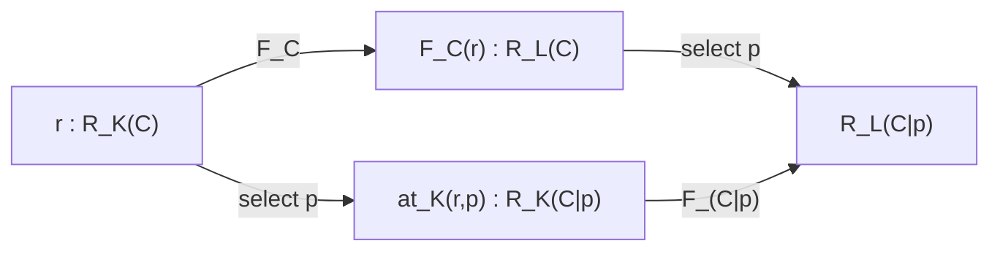
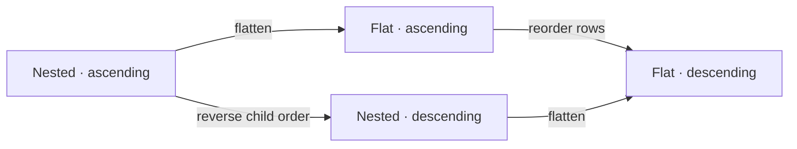
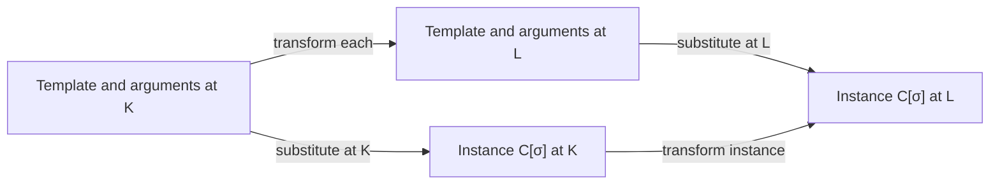

# One contract, many representations

## 1. What the model describes

The subject stays fixed while its representation changes. We write
`Representation<C, K>` for a representation of contract `C` at coordinates `K`.
A coordinate path describes a sequence of transformations of that same `C`.
Contract navigation describes a different operation: selecting a part of `C`.
Contract substitution fills whole sub-contract holes and forms a new subject
`C[σ]`. Representation transformations must also commute with that composition
when they support both open templates and their instances.
**Path transparency connects these two directions: select a part, then
transform it; or transform the whole, then select the same part.**

TypeScript is the **metalanguage** of this model. Its interfaces describe the
model; the Go and TypeScript artifacts in the examples are objects within that
model. These definitions state a developing theory; the examples supply finite
evidence for its laws. They do not change Nightseam's runtime or generator API.

The core is in [model.ts](model.ts), which contains only
types and interfaces. [examples/coordinates.ts](examples/coordinates.ts) shows
language and role coordinates. [examples/hierarchy.ts](examples/hierarchy.ts)
adds contract trees and executable checks of the transparency laws. The
[composition examples](examples/composition.ts) add whole-contract holes and
substitution. The
[self-contained HTML edition](index.html) includes diagrams and all
four sources.

| Notation     | Meaning                                                                |
| ------------ | ---------------------------------------------------------------------- |
| `S`          | An arbitrary semantic subject in the general model                     |
| `C`          | A particular subject with contract-tree structure                      |
| `O`          | The type of opaque local values                                        |
| `K`, `L`     | Coordinate assignments                                                 |
| `r : R_K(C)` | Shorthand for `Representation<C, K>`                                   |
| `p`, `q`     | Contract paths: lists of child keys                                    |
| `P`, `Q`     | Coordinate paths: sequences of transformation instances                |
| `C\|p`       | The sub-contract selected by a valid path `p`                          |
| `≈_K`        | The chosen equivalence of representations at `K`, for the same subject |

## 2. Coordinates and cells

An axis is an opaque ID. Each axis has opaque element IDs and may admit an
explicit empty value. The core needs equality of IDs, not an interpretation of
their names. The interpretation still belongs to the model: choosing an axis
for language, role, or syntax/semantics gives that coordinate a meaning.

```typescript
type Coordinates = Readonly<Record<string, string | number | boolean | null>>;

const goTypeSyntax = {
  '0:role': 'model-type',
  '0:form': 'syntax',
  '1:language': 'go',
  '2:execution': null,
} as const;
```

Ranked addresses such as `"1:language"` encode position and key in one opaque
axis ID. The core does not parse the rank or impose dependencies between ranks.
Those are rules of a chosen coordinate schema. In this model, `null` is an
explicit empty slot; **an omitted key differs from a key present with `null`**.
Adding or removing a key therefore changes that axis.

**E1 — Coordinate equality.** Two coordinates are equal exactly when their key
sets agree and all elements at matching axes agree. Equality must be reflexive,
symmetric, and transitive. Element IDs are compared within the same axis.

For a fixed `C`, the cell at `K` is the collection `R_K(C)` of its lawful
representations. A cell can contain many artifacts: differently formatted Go
interfaces, for example. Coordinates identify a cell, not a unique artifact.
Only meaningful coordinate assignments and inhabited cells need be present in
the graph. Optional higher ranks avoid inventing dummy values, but do not by
themselves prove that every possible combination has a representation.

## 3. Elementary transformations and coordinate paths

```typescript
type RepresentationMap<S, From, To> = (input: Representation<S, From>) => Representation<S, To>;
```

This is mathematical shorthand; the source file supplies the coordinate
constraints. An elementary `Transformation<S, From, To>` admits such a function
only when exactly one axis differs:

```text
Diff(K, L) = { a | K[a] and L[a] differ, including absence }
E2:  |Diff(K, L)| = 1

Equivalently: ∃a*. ∀a. (K[a] ≠ L[a] ⇔ a = a*)
```

The distinguished axis is chosen once for the entire pair. A transformation
with zero changes is not an elementary edge; neither is one changing two axes.
The TypeScript type is `never` for either case, and for broad or union-valued
coordinates that do not designate individual points.

For fixed `S`, the ordered tuple `(From, To)` determines the **transformation
signature**. A `TransformationInstance` additionally selects an actual function.
Two generators may have the same signature and produce different lawful
artifacts. Endpoint equality does not determine an algorithm.

A coordinate path `P` consists of adjacent steps and matching intermediate
coordinates. Its meaning `⟦P⟧` is their composition. The same `S` is carried
through every step. A composite may differ at several axes, return to its
starting coordinate, or do both along the way. A change involving several axes
can be decomposed only if the required intermediate representations and maps
exist; the model does not conjure them into existence.

**P1 — Path interpretation.** An empty path at `K` has one coordinate stop and
zero steps. It means identity. Writing `P ; Q` for doing `P` then `Q`:

```text
⟦empty_K⟧ = id
⟦P ; Q⟧ = ⟦Q⟧ ∘ ⟦P⟧
⟦(P ; Q) ; R⟧ = ⟦P ; (Q ; R)⟧
```

These are equations for mathematical maps. If an implementation models effects,
the effects must be included in its meaning and equivalence. A loop need not
mean identity. A same-coordinate normalization can be an unrestricted
`RepresentationMap`; it is not an elementary transformation under E2.

## 4. Giving the contract a hierarchy

The recursive type of finite **closed** contracts is:

```text
Contracts(O) = μX. Option(O) × FiniteMap(Key, X)
```

A particular `C` is an inhabitant of that type. Each node has an optional opaque
value and zero or more uniquely keyed children:

```typescript
interface ContractNode<O> {
  readonly kind: 'node';
  readonly value?: O;
  readonly children: ReadonlyMap<string, Contract<O>>;
}

// Closed case; section 12 adds whole-contract holes.
type Contract<O> = ContractNode<O>;
```

The map makes `at(C, key)` single-valued. A set of key/child pairs is equivalent
only with a uniqueness condition on keys. Child order has no contract meaning.
A node with neither a value nor children is a valid, present contract; it is
different from a missing child. The semantic model assumes finite, immutable,
acyclic trees. A TypeScript `ReadonlyMap` expresses a read-only view, not a proof
of those assumptions.

The hierarchical example represents this shape:

```text
BooleanCell
└─ operations                 (no local value)
   ├─ read: operation
   │  ├─ arguments            (present, empty node)
   │  └─ result: Bool
   └─ write: operation
      ├─ arguments
      │  └─ value: Bool
      └─ result: Unit
```

The strings used as values and keys are opaque IDs to the machinery. `Bool`
appearing twice does not merge its two occurrences: their contract paths
distinguish them. This example states shape only. If `O` refers to behavioral
specifications, their interpretation and preservation are additional semantic
obligations; storing a law's name does not establish that a program satisfies it.

## 5. Contract navigation

A contract path is a list of child keys; `++` concatenates lists and `[]` is
the empty path. Navigation can fail, so the executable model returns
`Selection<Contract<O>>`, a `found`/`missing` union.

**N1 — Root.**

```text
at(C, []) = found(C)
```

**N2 — Concatenation, including missing paths.**

```text
at(C, p ++ q) = bind(at(C, p), D ↦ at(D, q))
```

Here `bind(found(D), f) = f(D)` and `bind(missing, f) = missing`. Thus a missing
prefix stays missing. For valid paths, suppressing `found` gives the original
equation:

```text
at(C, p ++ q) = at(at(C, p), q)
```

Contract paths and coordinate paths must remain distinct. A contract path moves
from a subject to a sub-contract. A coordinate path changes the representation
of one fixed subject. They are the two directions in the transparency square.

## 6. Navigating a representation

For every admitted coordinate, representation navigation must expose the same
abstract children:

```text
at_K : (r : R_K(C), p : ValidPath(C)) → R_K(C|p)
```

The result keeps `K` and changes the subject from `C` to `C|p`. In the TypeScript
model, a `ContractLocation` records `root`, `path`, and `selected`; construction
must establish `selected = root|path`. It is a witness obligation, not a theorem
proved by that interface. The examples check it at runtime.

Abstract contract keys need not be native source names: Go `Read` and TypeScript
`read` can expose the same key. Selection need not mean cutting out text. A
selected representation may retain imports, an environment, or a reference to
the containing artifact so that the fragment has its intended meaning.

**R1 — Navigation domain and subject.** Every valid contract path has a
corresponding represented selection with subject `C|p`, at the same `K`. Invalid
paths cannot designate extra contract children. The example API accepts only
valid locations; its `locate` operation handles failure first.

**R2 — Representation navigation composes.** For valid paths:

```text
at_K(r, []) ≈_K r
at_K(r, p ++ q) ≈_K at_K(at_K(r, p), q)
```

**R3 — Faithful local surfaces.** Let `surface(C)` be its optional local value
and set of immediate child keys. Let `observe_K` inspect that surface in the
represented artifact, as modeled by `RepresentationObservation`:

```text
observe_K(at_K(r, p)) = surface(C|p)
```

Equality includes value presence, the opaque value when present, and precisely
the child-key set. It must be computed from the artifact's interpretation, not
inferred merely by reading `r.subject`. Together with navigation, this law gives
a value- and key-preserving isomorphism of the finite **exposed contract tree**
with `C`. Raw syntax may contain additional representation details.

This is where preserving the whole contract becomes more than retaining an ID.
The generic `C` parameter expresses the obligation, but TypeScript's structural
type system cannot prove artifact faithfulness or identity of runtime values.

If a coordinate cannot support a sub-contract, the navigation requirement is
not satisfied there. Supply a representation with sufficient context, or choose
a domain and coordinate schema that are closed under this navigation.

## 7. Transformation families and the transparency square

A function for just one fixed `C` cannot be applied to `C|p` by assumption. We
therefore introduce a family with a component for every contract in the chosen
domain:

```text
F : ∏ C. (R_K(C) → R_L(C))
F_C : R_K(C) → R_L(C)
```

```typescript
interface ContractRepresentationMap<O, From extends Coordinates, To extends Coordinates> {
  <C extends Contract<O>>(input: Representation<C, From>): Representation<C, To>;
}
```

`TransformationFamily` adds the one-axis requirement. `FamilyPath` composes such
families, so the same coordinate route can be followed at the root or at any
sub-contract. The admitted domain must be closed under selection. In this model
the contract domain is finite `Contract<O>` trees, with lawful representations
as inputs.

**T1 — Preservation.** `F_C` maps a lawful representation of `C` to a lawful
representation of that same `C`, preserving its chosen observations and any
included behavioral laws. This is required in addition to its type signature.

**T2 — Navigation transparency.** For every lawful `r` and valid `p`:

```text
at_L(F_C(r), p) ≈_L F_(C|p)(at_K(r, p))
```



The square commutes up to the chosen equivalence. The `NavigationTransparency`
interface packages the map, both navigation operations, and that equivalence.
It specifies a law to satisfy; a value of the interface is not a proof.

**Q1 — Equivalence and congruence.** `≈_K` must be an equivalence relation, and
equivalent representations must have the same chosen observations. Navigation
and transformations must respect equivalence:

```text
r ≈_K s  ⇒  at_K(r, p) ≈_K at_K(s, p)
r ≈_K s  ⇒  F_C(r) ≈_L F_C(s)
```

Choose the observations explicitly. Exact artifact equality works in the
canonical tree example. Other applications may ignore formatting or compare
behavior. Equivalence must be fine enough to preserve everything counted as
part of `C`.

T2 alone is insufficient for T1: uniformly replacing every opaque value with a
different value could commute with navigation while changing the contract.
Faithful surfaces and behavioral preservation rule this out.

## 8. The prefix law and arbitrary coordinate paths

The prefix form of the law becomes well-typed by applying the appropriate component
of the family at each selected subject:

**T3 — Prefix transparency.**

```text
F_(C|p++q)(at_K(r, p ++ q))
  ≈_L at_L(F_(C|p)(at_K(r, p)), q)
```

Read `C|p++q` as `C|(p ++ q)`. Using R2, this is T2 applied to the representation
already selected at `p`. Conversely, setting `p = []` recovers T2, using the root
law and congruence. Thus the two formulations express the same transparency
requirement.

**P2 — Transparency of composite paths.** If every step of `P : K → L` obeys
T2 and Q1, so does its composite:

```text
at_L(⟦P⟧_C(r), p) ≈_L ⟦P⟧_(C|p)(at_K(r, p))
```

For two consecutive steps `F : K → L` and `G : L → M`, the derivation is:

```text
at_M(G_C(F_C(r)), p)
  ≈_M G_(C|p)(at_L(F_C(r), p))        by transparency of G
  ≈_M G_(C|p)(F_(C|p)(at_K(r, p)))    by transparency of F and congruence of G
```

Identity is immediate; induction extends the argument to every finite path.
Replacing `F` by `⟦P⟧` in T3 also yields the mixed law for any coordinate route
and any contract-path split `p ++ q`. The example checks that equation directly
at every split of every valid path.

Mathematically, contract occurrences and their selections form a path category.
At each coordinate, lawful representations modulo `≈` and selection maps give
a set-valued functor. T2 makes the transformation family a natural
transformation between these functors. This interpretation assumes R1–R2 and
Q1; the TypeScript signature alone does not establish it. See Fong and Spivak,
[An Invitation to Applied Category Theory, §3.3.4](https://ocw.mit.edu/courses/18-s097-applied-category-theory-january-iap-2019/a4175d61479a35340d6307ae5e48ef5a_18-s097iap19textbook.pdf).

## 9. Transparency does not force a unique coordinate path

Several routes can connect the same cells, and several transformation instances
can connect the same pair. Navigation transparency says that **each route
commutes with selection**. It does not say that any two routes produce identical
artifacts.

**P3 — Parallel-path coherence, when required.** A stronger, separately chosen
law is:

```text
P, Q : K → L  ⇒  ⟦P⟧_C(r) ≈_L ⟦Q⟧_C(r)
```

If `≈` observes only the preserved contract, T1 already gives agreement at that
level. If it also observes formatting, implementation strategy, or other
representation details, coherence needs an additional argument. A chosen
isomorphism from each exposed contract to `C` determines the induced contract
correspondence between representations. It does not choose a unique generator,
artifact, or coordinate route.

Likewise, abstract contract isomorphism does not provide an executable inverse
generator. To require a round trip, supply a reverse map `G` and require
`G_C(F_C(r)) ≈ r` (and the other direction for a two-sided inverse). This is an
extra law, not a consequence of having the same subject parameter.

## 10. Worked example: two routes, one selected subtree

The hierarchy example has independent `layout` and `order` axes. Every artifact
encodes the same nine-node BooleanCell tree. Nested encodings store child pairs;
flat encodings store one row for **every node**, with its relative path and
optional value. Keeping rows for empty nodes is essential.



Each arrow changes one axis. The two routes change two axes in total. They
produce exactly equal canonical artifacts here, so this particular square also
satisfies P3. Nested selection follows child keys. Flat selection filters rows
by a prefix and removes that prefix from the selected rows. Both expose the
same selected contract and commute with the transformations.

The checks cover root and concatenation laws, missing paths, every local
surface, all four elementary families, their composition, and the original
prefix equation. They also cover the entirely empty contract. A deliberately
bad, correctly typed generator keeps only the flat root and drops descendants;
the law checker rejects it. A fabricated location naming the wrong selected
contract is rejected as well. A second bad generator replaces every local value:
it passes the commuting-square checks, but the faithful-surface check rejects it.

## 11. Interpreting generator roles

The core reserves no role names. A concrete domain model can choose coordinates
such as the following, with preservation judged against the same chosen `C`:

| Operation                 | Possible representation change                                                                                                                |
| ------------------------- | --------------------------------------------------------------------------------------------------------------------------------------------- |
| Type generator            | Contract declaration syntax → native model-type syntax                                                                                        |
| Adapter generator         | A description of `C` and its selected binding → adapter syntax exposing `C`                                                                   |
| Implementation generator  | A description of `C` → implementation syntax realizing `C`                                                                                    |
| Interpretation or loading | Syntax → its semantic realization, with language/runtime coordinates as needed                                                                |
| Ordinary program function | A function between values; it is a representation transformation only when it also preserves the chosen subject and fits the coordinate rules |

These are modeling choices, not claims about an existing Nightseam API. An
adapter or implementation generator may need a selected native type, strategy,
or other inputs. Include those in its specified environment or input model;
they cannot be inferred from the identity of `C` alone. If several axes change,
use a lawful path where one exists, or an unrestricted map outside the primitive
edge type. A behaviorally rich contract also needs more than a generated method
signature to establish preservation.

## 12. Whole-contract holes

A generic stands for a complete sub-contract, including its value and children.
The union therefore surrounds the entire node constructor:

```text
Contracts(O, G) = μX. Generic(G) + (Option(O) × FiniteMap(Key, X))
```

`G` is a context of allowed opaque generic IDs. A template may use an ID more
than once, or not use every ID in its context. All occurrences of one ID denote
the same parameter. The core now expresses both open and closed contracts:

```typescript
type Generic<G extends string> = [G] extends [never] ? never : { readonly kind: 'generic'; readonly id: G };

interface ContractNode<O, G extends string = never> {
  readonly kind: 'node';
  readonly value?: O;
  readonly children: ReadonlyMap<string, Contract<O, G>>;
}

type Contract<O, G extends string = never> = ContractNode<O, G> | Generic<G>;
```

`Contract<O, never>` has no holes and recovers the previous closed-tree model.
A hole has neither a value nor children. An ordinary node without a value or
children remains a complete, empty contract and is never implicitly a hole.
At open contracts, faithful representation additionally preserves the node/hole
distinction and the identity of each generic.

For example, `Pair[g0]` can contain two occurrences of `g0`:

```text
Pair[g0]                   g0 := List[h0]                h0 := Bool

Pair                       Pair                          Pair
├─ first → ?g0             ├─ first → List                ├─ first → List
└─ second → ?g0            │  └─ element → ?h0            │  └─ element → Bool
                           └─ second → List              └─ second → List
                              └─ element → ?h0              └─ element → Bool
```

The inserted contract supplies the whole structure at each occurrence. Filling
a hole need not close the template: the replacement can itself have holes.
Hole IDs belong to a chosen context. When combining independently named
templates, consistently rename IDs if they are intended to remain distinct.
The current language has no binders; introducing binders later would require
additional scoping and capture-avoidance rules.

## 13. Substitution and its composition laws

A substitution assigns a contract to every generic in its source context:

```text
σ : G → Contracts(O, H)
C : Contracts(O, G)
C[σ] : Contracts(O, H)
```

This is the `Substitution<O, G, H>` type. An assignment to closed contracts has
`H = never`. Partial instantiation is expressed by mapping each unfilled
parameter to a generic in the target context. Bindings are total and consistent;
every repeated occurrence of a parameter receives the same contract.

**S1 — A hole is replaced by its entire argument.**

```text
Generic(g)[σ] = σ(g)
```

**S2 — Substitution distributes through ordinary nodes.**

```text
Node(v, children)[σ] = Node(v, { k ↦ children(k)[σ] })
```

These definitions preserve every existing ordinary node's optional value and
child keys. Only a hole occurrence is replaced. Substitution is simultaneous:
the replacement `σ(g)` is returned as supplied; the same `σ` is not recursively
applied inside it. For example, substituting `g0 := Box[g0]` once into `g0`
produces `Box[g0]`, rather than expanding forever.

**S3 — Identity.** The identity substitution sends each generic to itself:

```text
η_G(g) = Generic(g)
C[η_G] = C
```

**S4 — Staged substitution equals composed substitution.** For
`σ : G → Contracts(O, H)` and `τ : H → Contracts(O, I)`, define:

```text
(σ ⋆ τ)(g) = σ(g)[τ]
(C[σ])[τ] = C[σ ⋆ τ]

η_G ⋆ σ = σ
σ ⋆ η_H = σ
(σ ⋆ τ) ⋆ υ = σ ⋆ (τ ⋆ υ)
```

The last three equations are pointwise equations on bindings; the contexts
must match. Induction on the template proves the substitution laws from S1–S2.
Equality here is equality of abstract contract expressions, including opaque
values, keyed structure, and generic IDs. A particular allocation or amount of
heap sharing is not part of that equality.

Substitution forms the subject `C[σ]`. It is **not** an elementary
`Transformation<C, K, L>`: it changes the subject and can keep coordinates
unchanged. The enlarged model therefore has two distinct operations:

| Operation                     | Subject                             | Coordinates                                 |
| ----------------------------- | ----------------------------------- | ------------------------------------------- |
| Representation transformation | Preserves `C`                       | Changes exactly one axis per primitive step |
| Contract instantiation        | Forms `C[σ]` from `C` and arguments | May take place at the same `K`              |

A path mixing these operations must track its subject as well as its
coordinates. The original fixed-subject paths remain exactly as defined.

## 14. Navigation through composed contracts

**S5 — Existing paths commute with substitution.** If `p` selects an existing
node or hole in the original template:

```text
at(C[σ], p) = at(C, p)[σ]
```

An ordinary node remains at the same path. When that path ends at a hole, its
selection after substitution is the supplied replacement contract.

**S6 — Paths can continue inside an inserted contract.** If `at(C, p) = Generic(g)`:

```text
at(C[σ], p ++ q) = at(σ(g), q)
```

The right side may still be partial. It can select another hole if the
replacement remains open. These two laws explain how a contract path crosses
from the original template into an argument.

The validity condition in S5 matters. Before filling `Pair[g0]`, the path
`first / element` cannot be resolved. After `g0 := List[h0]`, it selects `h0`;
after `h0 := Bool`, it selects `Bool`. A missing child of a known ordinary node
stays missing, but an unresolved path continuing through a hole may become
valid. Thus a blanket equation propagating every failed template lookup through
substitution would be incorrect.

## 15. Substitution transparency across representations

At each admitted coordinate `K`, represent both the template and its arguments:

```text
r : R_K(C)
a(g) : R_K(σ(g))
plug_K(r, a) : R_K(C[σ])
```

`RepresentedSubstitution` associates each semantic argument with its represented
argument. `SubstitutionApplication` witnesses the particular resulting subject
`D = C[σ]`. `RepresentationSubstitution` returns a representation of that `D`
at the same coordinate. The witness and artifact faithfulness are semantic
obligations, checked in the examples; merely constructing their records is
insufficient.

**S7 — Representation substitution respects identity and composition.**
Represented holes act as identities. Filling represented arguments in stages
agrees, up to the chosen equivalence, with first composing the represented
arguments and then filling once. Plugging must also respect equivalence of the
template and pointwise equivalence of its arguments. These are the represented
counterparts of S3–S4, including their congruence requirement.

**S8 — Transformation commutes with substitution.** Let `F : K → L` be a family
defined for the open template, its arguments, and its instance. Then:

```text
F_(C[σ])(plug_K(r, a))
  ≈_L plug_L(F_C(r), g ↦ F_(σ(g))(a(g)))
```



This is the connecting law: **fill, then transform; or transform the template
and every argument, then fill**. The `SubstitutionTransparency` interface records
the operations needed to state it. The fourth parameter of `TransformationFamily`
and `FamilyPath` specifies their allowed generic context; using `GenericId`
admits both open and closed contracts. Their default remains the closed case.

As with navigation transparency, S8 lifts to any coordinate path whose steps
satisfy it: push each step through plugging, use congruence, then compose the
transformed arguments. Consequently a pipeline can commute with instantiation,
not just an individual generator. This requires all the relevant representations
and operations to exist; a target supporting only closed contracts cannot take
the open-template route by assumption.

The strength of S8 depends on `≈`. If it observes only the instantiated contract,
faithful substitution and preservation already imply agreement at that level.
Exact generated-source equality is a stronger requirement. A specialized
generator and a generic template may produce different but equivalent code.

The [composition example](examples/composition.ts) uses nested and flat encodings
of open contracts. A flat hole row is replaced by every row of its argument,
with the occurrence path prefixed. An inserted empty contract still supplies a
root row. Transforming the filled nested tree produces exactly the same flat
artifact as filling the transformed template with transformed arguments.

The example checks repeated holes, multiple different holes, a root hole, empty
contracts, replacements containing holes, same-named holes surviving one-pass
substitution, the identity/composition laws, and paths entering inserted trees.
It rejects inconsistent represented arguments and fabricated result witnesses.

## 16. What the TypeScript establishes

| Obligation                                                       | How the model addresses it                                                       |
| ---------------------------------------------------------------- | -------------------------------------------------------------------------------- |
| One changed axis at each primitive step                          | Conditional types, for finite literal coordinates                                |
| Matching coordinate endpoints along a path                       | A tuple of typed adjacent steps                                                  |
| Same subject type through transformation                         | Generic input/output parameter `C`; runtime identity remains a law               |
| Family available at sub-contracts                                | Polymorphic call signature, plus the domain-closure requirement                  |
| Valid contract location                                          | Explicit witness data, checked in examples                                       |
| Faithful surfaces and navigation laws                            | Executable checks on the supplied trees and encodings                            |
| Universal transparency, equivalence, and behavioral preservation | Semantic requirements; finite checks and TypeScript are not universal proofs     |
| Parallel-path coherence or an inverse                            | Additional laws where requested, never inferred from endpoints                   |
| Entire sub-contract holes and closed contracts                   | A node/hole union, indexed by an allowed generic context; `never` excludes holes |
| Substitution contexts and resulting subject                      | Typed bindings and an explicit application witness; equality checked in examples |
| Substitution/navigation/transformation interchange               | Stated laws and executable nested/flat examples; not universal proofs            |

From the repository root, with Node 22.12 or later and `pnpm install`:

```sh
pnpm --filter @nightseam/theory verify
pnpm --filter @nightseam/theory render
```

`verify` checks the types, runs the examples, and checks that the HTML edition
is current. `render` regenerates it from this page and the four source files.
The package scripts enable Node's TypeScript stripping; no compiled model is
published.

The executable examples operate on model artifacts. They do not run Go, compile
the illustrative source strings, or execute Nightseam's generators.
